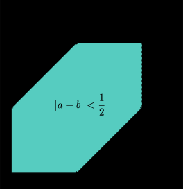

---
title: 几何概型
tag: 
---

$\gdef\str#1{{\footnotesize #1}}$

设 $(\Omega, \mathcal{F}, \mu)$ 是一个测度空间, $\Omega$ 可测, $\mathcal{F}$ 是 $\Omega$ 上的 $\sigma$-代数, $\mu$ 是有限测度且 $0 < \mu(\Omega) < \infty$. 则此测度空间上 $A \in F$ 的几何概率 $P(A)$ 定义为 $P(A) = \frac{\mu(A)}{\mu(\Omega)}$. 此定义为的是随机向量服从 $\Omega$ 上的均匀分布, 即联合概率密度函数为 
$$ f(x) = \begin{cases} \dfrac{1}{\mu(\Omega)}, & x \in \Omega \\ 0, & x \notin \Omega \end{cases} $$

$\textbf{Example.}$ 任取两个数 $a,b \in [0, 1]$, 求 $|a-b| < \frac12$ 的概率. 

<figure></figure>

如图, 我们只须计算平面上 $|a-b|<\frac12$ 区域的面积 $S$, 所求概率 $P = \frac{\mu(S)}{\mu(\Omega)}$, 即 $1-2 \cdot (\frac12)^3 = \frac34$. 
